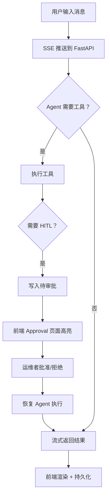

# AI Agent 控制台 - 产品需求文档（PRD）

## 1. 产品概述

为基于 LangChain + LangGraph 构建的多功能 AI Agent 提供一个现代化、可视化、可交互的 Web 控制台，承接 [api.py](file:///e:/langChain_langGraph/ai_agent/api.py) 与 [web_ui.py](file:///e:/langChain_langGraph/ai_agent/web_ui.py) 已有的 FastAPI 接口（含 SSE 流式聊天、Agent 列表、能力注册、HITL 审批、可观测性事件、负载统计等），让用户能在浏览器中以「深色科技感」美学完成对话、查看工具调用过程、并对后端 Agent 集群进行运维式观察。

- 目标用户：AI 应用开发者 / Agent 平台使用者 / 个人极客
- 目标价值：把「命令行 + 单文件 HTML」体验升级到「Cursor / v0 级别」的现代 Web 体验，且完全本地化、无第三方依赖

## 2. 核心功能

### 2.1 用户角色

| 角色 | 注册方式 | 核心权限 |
|------|---------|---------|
| 终端用户 | 无需登录（本地开发模式） | 对话、使用工具、查看自己会话历史 |
| 运维者 | 无需登录（本地开发模式） | 查看多 Agent 状态、负载、事件、Trace、HITL 审批 |

> 备注：当前阶段定位为本地工具，不引入多租户/鉴权；如需鉴权可后续接入。

### 2.2 功能模块

1. **聊天主界面（Chat）**：SSE 流式对话、Markdown 渲染、代码高亮、工具调用可视化、停止生成、会话列表
2. **Agent 集群面板（Agents）**：列出所有 Agent、worker profile、能力、负载、健康度
3. **HITL 审批中心（Approval）**：查看待审批请求、批准/拒绝、查看历史
4. **可观测性（Observability）**：最近事件、最近 Trace、Prometheus 指标
5. **工具广场（Tools）**：列出后端可用工具 / 能力，支持搜索

### 2.3 页面与功能

| 页面 | 模块 | 功能描述 |
|------|------|---------|
| Chat | 会话侧栏 | 列出本地历史会话，新建、删除、重命名、切换 |
| Chat | 消息流 | 实时 SSE 流式输出，markdown 渲染（GFM），代码块复制 |
| Chat | 输入区 | 多行输入、Shift+Enter 换行、Enter 发送、停止按钮、模型/Provider 切换 |
| Chat | 工具调用卡 | 当 Agent 调用工具时，以时间线/卡片显示调用名、参数、耗时、结果 |
| Agents | 列表 | 卡片网格展示 Agent 头像、状态（idle/running/error）、当前任务 |
| Agents | 详情抽屉 | 能力清单、近期任务、负载曲线 |
| Approval | 待审批列表 | 高亮显示待处理请求，批准/拒绝按钮 |
| Approval | 历史 | 已处理请求时间线 |
| Observability | Events | 实时事件流，按级别过滤 |
| Observability | Traces | Trace span 列表（树形展示） |
| Observability | Metrics | Prometheus 文本卡（只读） |
| Tools | 列表 | 所有工具/能力，搜索/筛选 |
| Tools | 详情 | 工具描述、参数 schema |

## 3. 核心流程

### 3.1 聊天主流程

1. 用户在输入框输入消息 → 点击发送
2. 前端通过 SSE（`POST /api/chat/stream`）向后端发起请求
3. 后端逐步推送 `token` / `tool_call` / `tool_result` / `done` 事件
4. 前端实时渲染增量文本，并在工具调用时插入 ToolCard
5. 流结束后，前端将完整会话写入本地 IndexedDB（`zustand persist`）

### 3.2 审批流程

1. 后端在需要人类决策时（[human_in_loop.py](file:///e:/langChain_langGraph/ai_agent/human_in_loop.py)）写入待审批
2. 运维者打开 Approval 页面 → 看到高亮待办
3. 点击「批准/拒绝」→ 调用 `POST /api/hitl/decide`
4. 后端恢复执行 → 该事件通过 SSE 推回 Chat 界面

## 4. 用户界面设计

### 4.1 设计风格

- **主色板**：以 `zinc-950` 为底，深空黑 `#0A0A0B`；强调色用青蓝渐变 `#06B6D4 → #3B82F6`；危险用 `#F43F5E`，成功用 `#10B981`
- **辅助色**：玻璃态卡片（半透明白 + 模糊）、`#1A1B1E` 卡片底
- **按钮**：圆角 10px，主按钮渐变背景 + 内阴影；次按钮玻璃描边
- **字体**：标题用 `Geist` / `Manrope`（等宽权重美），正文用 `Inter` 替代品 `Satoshi`，代码用 `JetBrains Mono`；避免使用通用 Inter
- **图标**：统一使用 `lucide-react`，统一 1.5px 描边
- **布局**：左侧固定侧栏（会话/导航），主区域三栏（Chat 页面用 `导航 | 会话列表 | 消息流`，其余页面用 `导航 | 列表 | 详情`）
- **动效**：页面进入 staggered reveal（50ms 错峰）、按钮 hover 微动、消息气泡 fade-in 上滑、工具调用时间线绘制
- **装饰**：背景带 radial gradient mesh + 噪点纹理（5% 透明度）、顶部 1px 渐变高光

### 4.2 页面设计概览

| 页面 | 模块 | UI 元素 |
|------|------|---------|
| Chat | 消息流 | 玻璃卡片、用户消息靠右带渐变描边、AI 消息靠左带光晕、Markdown 高亮 |
| Chat | 工具卡 | 圆角卡片 + 左侧 2px 渐变色条、参数折叠/展开、运行中 shimmer |
| Agents | 卡片 | 渐变边框（按健康度变色）、状态点（呼吸光）、Sparkline 负载 |
| Approval | 待办 | 黄色高亮卡，CTA 按钮置于右上角，操作前 300ms 二次确认动画 |
| Observability | 事件流 | 终端式等宽字体，按级别（info/warn/error）左侧 3px 边色 |
| Tools | 列表 | 网格卡片 + 顶部搜索框 + 类型 chip 过滤 |

### 4.3 响应式

- 桌面优先（≥1280px 完整三栏）
- 平板（768–1280px）：两栏，侧栏可折叠
- 移动端（<768px）：单栏 + 抽屉式导航，输入区常驻底部

### 4.4 3D 场景指导

- 不使用 3D 场景（聚焦 2D 高密度信息呈现，符合 AI 控制台产品定位）
