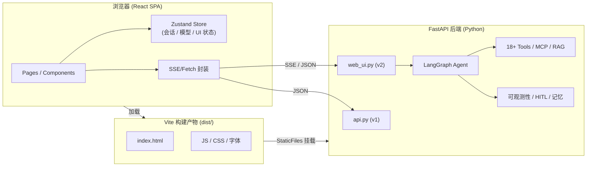
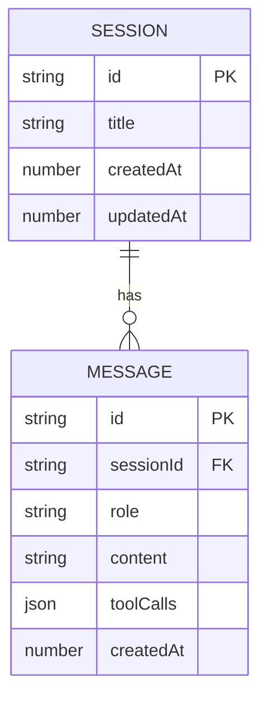

# AI Agent 控制台 - 技术架构文档

## 1. 架构设计

整体为「前后端分离 + 同源部署」架构：前端是独立 Vite/React 应用（开发期独立 dev server），构建产物最终由 FastAPI 通过 `StaticFiles` 托管在同源下，避免 CORS 与登录态分裂。后端为既有 FastAPI 应用，不做修改。



## 2. 技术选型

- **前端框架**：React 18 + TypeScript + Vite 5
- **路由**：React Router 6（`react-router-dom`）
- **状态管理**：Zustand（含 `persist` 中间件，IndexedDB/localStorage 持久化）
- **样式**：Tailwind CSS 3 + CSS Variables（设计 tokens）
- **组件库**：`shadcn/ui`（按需复制源码到 `src/components/ui/`，不强制依赖）
- **图标**：`lucide-react`
- **Markdown**：`react-markdown` + `remark-gfm` + `react-syntax-highlighter`（Prism）
- **流式**：`@microsoft/fetch-event-source`（POST SSE）或原生 `fetch` + ReadableStream
- **动画**：`framer-motion`（仅在关键交互/页面切换使用，避免滥用）
- **图表**：`recharts`（Agent 负载 sparkline、metrics mini-chart）
- **HTTP**：`ky`（轻量 fetch 封装，带超时/重试）
- **初始化工具**：`pnpm create vite@latest`（react-ts 模板）
- **后端**：沿用现有 FastAPI，不做改动（仅补 CORS allow-origin 以兼容开发期 5173 端口）
- **数据库**：不引入新数据库（沿用 SQLite 持久化 + IndexedDB 本地）

## 3. 目录结构

```
web_console/                      # 新建独立前端项目（与 ai_agent/ 平级）
├── index.html
├── package.json
├── vite.config.ts
├── tailwind.config.js
├── postcss.config.js
├── tsconfig.json
├── src/
│   ├── main.tsx
│   ├── App.tsx
│   ├── router.tsx
│   ├── styles/
│   │   ├── globals.css
│   │   └── tokens.css
│   ├── pages/
│   │   ├── Chat.tsx
│   │   ├── Agents.tsx
│   │   ├── Approval.tsx
│   │   ├── Observability.tsx
│   │   └── Tools.tsx
│   ├── components/
│   │   ├── layout/
│   │   │   ├── AppShell.tsx
│   │   │   ├── Sidebar.tsx
│   │   │   └── TopBar.tsx
│   │   ├── chat/
│   │   │   ├── MessageList.tsx
│   │   │   ├── MessageBubble.tsx
│   │   │   ├── Composer.tsx
│   │   │   ├── ToolCallCard.tsx
│   │   │   └── SessionList.tsx
│   │   ├── agents/
│   │   │   ├── AgentCard.tsx
│   │   │   └── AgentDetailDrawer.tsx
│   │   ├── approval/
│   │   │   └── PendingItem.tsx
│   │   ├── observability/
│   │   │   ├── EventStream.tsx
│   │   │   ├── TraceList.tsx
│   │   │   └── MetricsPanel.tsx
│   │   ├── tools/
│   │   │   └── ToolCard.tsx
│   │   └── ui/                  # shadcn/ui 复制件（Button/Card/Badge/Sheet 等）
│   ├── hooks/
│   │   ├── useChatStream.ts     # SSE 封装
│   │   ├── useEventSource.ts
│   │   └── useAgents.ts
│   ├── stores/
│   │   ├── chatStore.ts
│   │   ├── sessionStore.ts
│   │   └── uiStore.ts
│   ├── lib/
│   │   ├── api.ts               # ky 实例 + 拦截器
│   │   ├── sse.ts               # POST SSE 工具
│   │   └── format.ts
│   └── types/
│       ├── agent.ts
│       ├── message.ts
│       └── api.ts
```

## 4. 路由定义

| 路由 | 页面 | 说明 |
|------|------|------|
| `/` | Chat | 默认聊天主界面 |
| `/agents` | Agents | Agent 集群面板 |
| `/approval` | Approval | HITL 审批中心 |
| `/observability` | Observability | 事件 / Trace / Metrics |
| `/tools` | Tools | 工具广场 |
| `/settings` | Settings | 模型 / Provider / API Key 配置 |

## 5. API 对接

所有接口以前缀 `VITE_API_BASE` 区分开发/生产；开发期默认 `http://localhost:8000`。

```ts
// types/api.ts
export type Role = "user" | "assistant" | "system" | "tool";
export type ToolCallStatus = "pending" | "running" | "success" | "error";

export interface ChatMessage {
  id: string;
  sessionId: string;
  role: Role;
  content: string;
  toolCalls?: ToolCall[];
  createdAt: number;
}

export interface ToolCall {
  id: string;
  name: string;
  args: Record<string, unknown>;
  result?: string;
  status: ToolCallStatus;
  startedAt: number;
  endedAt?: number;
}

export interface Agent {
  id: string;
  name: string;
  status: "idle" | "running" | "error";
  capabilities: string[];
  load: number;
  profile?: Record<string, unknown>;
}

export interface PendingApproval {
  id: string;
  sessionId: string;
  toolName: string;
  reason: string;
  createdAt: number;
}

export interface TraceSpan {
  id: string;
  parentId?: string;
  name: string;
  startedAt: number;
  endedAt?: number;
  attrs?: Record<string, unknown>;
}
```

### 后端接口映射

| 前端调用 | 后端 | 方法/路径 |
|----------|------|-----------|
| 流式聊天 | web_ui | `POST /api/chat/stream` (SSE) |
| 列出 Agent | web_ui | `GET /api/agents` |
| 实时负载 | web_ui | `GET /api/load_stats` |
| 待审批 | web_ui | `GET /api/hitl/pending` |
| 提交审批 | web_ui | `POST /api/hitl/decide` |
| 最近事件 | web_ui | `GET /api/events?limit=100` |
| 最近 Trace | web_ui | `GET /api/traces?limit=100` |
| 能力列表 | web_ui | `GET /api/capabilities` |
| 健康检查 | web_ui | `GET /api/health` |
| 设置 API Key | api | `POST /set_api_key` |
| 切换模型 | api | `POST /switch_model` |
| 普通聊天 | api | `POST /chat` |

## 6. 数据模型

前端会话数据使用 IndexedDB（通过 `idb-keyval` 轻量封装）持久化，结构如下：



## 7. 设计 Tokens（CSS 变量）

```css
:root {
  --bg-0: #0A0A0B;          /* 深空黑 */
  --bg-1: #111114;          /* 卡片底 */
  --bg-2: #1A1B1E;          /* 悬浮卡 */
  --border: rgba(255,255,255,0.08);
  --fg-0: #ECECEE;
  --fg-1: #A1A1AA;
  --fg-2: #71717A;
  --accent-1: #06B6D4;      /* 青 */
  --accent-2: #3B82F6;      /* 蓝 */
  --accent-grad: linear-gradient(135deg, var(--accent-1), var(--accent-2));
  --danger: #F43F5E;
  --success: #10B981;
  --warn: #F59E0B;
  --radius-card: 12px;
  --radius-btn: 10px;
}
```

## 8. 部署集成

- `pnpm build` 生成 `dist/`
- 调整 `ai_agent/api.py`：将 `StaticFiles` 挂载从 `web/` 切换到 `../web_console/dist`（相对路径或绝对路径）
- 根路径 `/` 优先返回 `dist/index.html`（SPA fallback），静态资源走 `StaticFiles`
- 保留 `web/index.html`（旧版）作为兜底：`/legacy` 路径返回

## 9. 风险与权衡

- **风险 1**：SSE POST 在浏览器端需借助 `fetch-event-source` 或自己封装 `ReadableStream`——选择自己封装以减少依赖
- **风险 2**：Markdown 大内容渲染性能——使用 `React.memo` + 消息分页（>200 条虚拟列表 `react-virtuoso`）
- **风险 3**：shadcn/ui 组件 Tailwind 版本需匹配——本项目固定 Tailwind 3
- **不引入**：Next.js（避免双服务）、国际化（首版仅中英混排）、鉴权（本地工具）
