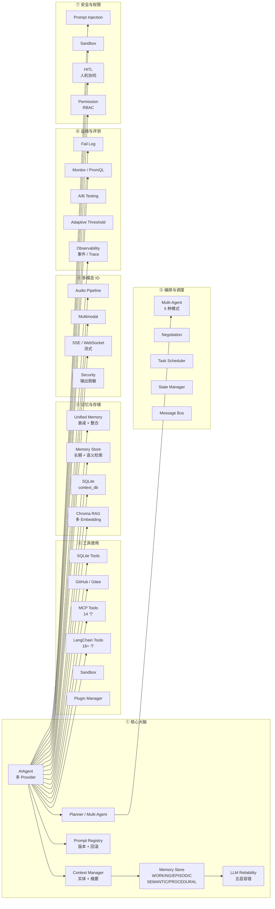

# LangChain × LangGraph AI Agent

> 一站式多功能 AI Agent 平台：后端 LangChain 1.x + LangGraph + MCP，前端 React/Vite 控制台，可分发 Windows / Linux / macOS 桌面二进制，可经 PyPI / Docker GHCR / Scoop / Homebrew 多渠道分发。

[](https://github.com/colbertlee/langChain_langGraph/actions/workflows/backend-ci.yml)
[](https://github.com/colbertlee/langChain_langGraph/actions/workflows/ci.yml)
[](https://github.com/colbertlee/langChain_langGraph/actions/workflows/release.yml)
[](https://www.python.org/)
[](https://nodejs.org)
[](https://pypi.org/project/ai-agent/)
[](https://ghcr.io/colbertlee/ai-agent-console)
[](LICENSE)
[](https://github.com/astral-sh/ruff)

---

## 0. 兼容性矩阵

| 项 | 支持范围 | 备注 |
|---|---|---|
| Python | 3.11 / 3.12 / 3.13 | CI 测 3.11 + 3.12 |
| Node.js | 20 LTS / 22 LTS | React 控制台 dev 与 e2e 必需 |
| 操作系统 | Windows 10/11、macOS 12+、Ubuntu 20.04+/Debian 11+ | 桌面二进制分别构建 |
| 浏览器 | Chrome 120+ / Edge 120+ / Safari 17+ / Firefox 122+ | React 控制台 + 主界面 |
| Docker | 24+ / docker compose v2 | 镜像含 healthcheck |
| 内存 | ≥ 4 GB（PyInstaller 解压后 ~1.2 GB） | 桌面包 |
| 磁盘 | ≥ 3 GB（含 RAG / Chroma 索引） | 桌面包 |
| LLM Provider | 11 家 / 70+ 模型 | 见 §4.2 |
| Embedding | OpenAI / 智谱 / MiniMax / Jina | 见 [ai_agent/rag.py](file:///e:/langChain_langGraph/ai_agent/rag.py) |
| 移动端 | 仅查看（Web UI 自适应，不保证完整功能） | 不在 Roadmap 内 |

---

## 1. 项目概览

`langChain_langGraph` 是面向生产的多功能 AI Agent 平台。围绕 LangChain 1.x、LangGraph、MCP（Model Context Protocol）三大基座，沉淀了企业级所需的能力：高可用容错、结构化记忆、多 Agent 协作、人机协同、Prompt 工程化、ETF/金融分析、安全防御、可观测性、桌面级分发。

### 1.0 · 为什么选这个项目(对比)

| 维度 | 本项目 | LangChain 原生 | CrewAI | AutoGen |
|---|---|---|---|---|
| 多 LLM Provider 容错 | ✅ 五层栈 | ⚠ 需手写 | ⚠ 单 Provider | ⚠ 单 Provider |
| 多 Agent 编排 | ✅ 5 模式(S/H/P/Seq/Fan) | ⚠ 需自己拼图 | ✅ Crew/Task | ✅ GroupChat |
| 结构化记忆(WORKING/EPISODIC/SEMANTIC/PROCEDURAL) | ✅ 内置 | ❌ | ❌ | ❌ |
| Prompt 版本化 + 回滚 | ✅ | ❌ | ❌ | ❌ |
| 人机协同 HITL | ✅ Web 审批中心 | ❌ | ⚠ 钩子 | ⚠ 钩子 |
| MCP 工具协议 | ✅ | ⚠ 第三方 | ❌ | ❌ |
| 中文友好(11 家国内 Provider) | ✅ | ⚠ 仅 OpenAI | ⚠ OpenAI 系 | ⚠ OpenAI 系 |
| 桌面二进制分发 | ✅ Win/Linux/macOS | ❌ | ❌ | ❌ |
| 可观测性(Prom + Trace) | ✅ | ⚠ LangSmith | ❌ | ⚠ 基础 |
| 学习曲线 | 中(模板齐全) | 高 | 中 | 中 |

> 如果你**只用 OpenAI 且不需要记忆与多 Agent**,LangChain 原生就够了。如果你需要**生产级容错 / 跨 Provider / 多端分发**,本项目可以省你 3-6 个月。

仓库由三个互相协作的子项目组成：

| 子项目 | 路径 | 角色 |
|---|---|---|
| **AI Agent 后端** | [`ai_agent/`](file:///e:/langChain_langGraph/ai_agent/README.md) | Python 包：Agent 核心、工具集、RAG、MCP、多 Agent、流式记忆、可观测性、安全、Skill。提供 PyPI 包、`ai-agent` CLI、FastAPI 服务。可 PyInstaller 打包成 Windows / Linux / macOS 单文件二进制。 |
| **Web 控制台** | [`web_console/`](file:///e:/langChain_langGraph/web_console/.github/RELEASE.md) | React 19 + TypeScript + Vite 5 + Tailwind 3 + Zustand：深色科技感 SPA，对话 / Agents / Approval / Observability / Tools / Settings / Prompts / Memory 八大页面，Assistant-UI 适配后端 SSE。 |
| **桌面 / 容器分发** | [`ai_agent/package/`](file:///e:/langChain_langGraph/ai_agent/package/README.md) | Windows / Linux 全套可分发包：`install.bat / run.bat / run-web.bat` + `install.sh / run.sh / run-web.sh` + 离线运行时 + 内置知识库 + MCP 配置。 |
| **顶层 GitHub 配置** | [`.github/`](file:///e:/langChain_langGraph/.github) | workflow / issue 模板 / 安全策略 / CODEOWNERS / PR 模板。 |

### 1.1 适用对象

- 想搭一套**生产级 Agent**但又不想从 0 写 LangGraph 状态机的应用开发者。
- 需要**多 Provider、多模态、多 Agent**协作，且对容错、可观测、Prompt 版本化有要求的团队。
- 想给团队一个**桌面级即开即用**的 Agent 客户端，又不想让用户装 Python / Node 的运维/支持同事。
- 想学习**FastAPI + SSE + WebSocket**、**PyInstaller 跨平台打包**、**GitHub Actions OIDC 发版**的工程师。

### 1.2 核心能力亮点

#### 截图一览

| 主界面·对话 | 主界面·设置(模型下拉) | Stage A 演示 |
|---|---|---|
|  |  |  |
| 11 家 Provider 切换 + 流式工具调用 | 模型按 group 分组,未配置 Key 灰显 | 端到端能力演示 |

模型下拉细节:


---

| 类别 | 能力 | 实现位置 |
|---|---|---|
| 多 LLM Provider | OpenAI、DeepSeek、通义千问、智谱 GLM、Kimi、MiniMax、百度文心、讯飞星火、豆包、腾讯混元、硅基流动（共 11 家、70+ 模型） | `ai_agent/config.py` |
| 多级容错 | 五层容错栈：Timeout → Retry → FallbackChain → CircuitBreaker → GracefulDegradation | `ai_agent/llm_reliability.py` |
| 主备模型 | Primary/Standby 自动故障切换 + Standby 预热 | `ai_agent/llm_reliability.py` |
| 结构化上下文 | 自动实体提取、上下文构建、按重要性分配 token 预算、自动摘要 | `ai_agent/context_manager.py` |
| 统一记忆 | WORKING / EPISODIC / SEMANTIC / PROCEDURAL 四类，重要性分级 + 衰减 + 整合 | `ai_agent/memory_store.py` |
| 多 Agent 编排 | Supervisor / Parallel / Sequential / Hierarchical / Fanout | `ai_agent/multi_agent.py` |
| 协商与竞价 | Negotiation + Auction（第一价格/第二价格/英式/荷兰式） | `ai_agent/negotiation.py` |
| 可靠性 | RetryPolicy / CircuitBreaker / DeadLetterQueue | `ai_agent/reliability.py` |
| 能力注册 | Worker profile、负载均衡（RoundRobin / Random / LeastLoaded） | `ai_agent/capability.py` |
| 消息协议 | 本地总线 + Redis 分布式总线 + PubSub 场景 | `ai_agent/message_protocol.py`、`message_bus.py`、`distributed_bus.py` |
| 工具 | 30+ 内置 + MCP 14 个 + ETF 7 个 + GitHub / Gitee / 文件 / 网络 / 代码 | `ai_agent/tools.py`、`mcp_tools.py` |
| RAG | Chroma + 多 Embedding（OpenAI / 智谱 / MiniMax / Jina） | `ai_agent/rag.py` |
| Skill 框架 | 深度研究 / 代码文档 / PPT 大纲 / 论文审阅 / 图表可视化 | `ai_agent/skills.py` |
| 安全 | 输入过滤、输出脱敏、Prompt Injection 检测、危险命令拦截、AST 白名单表达式求值 | `ai_agent/security.py` |
| 人机协同 | HookPoint 策略（PASS / ASK / BLOCK）、Web 端批准/拒绝/历史 | `ai_agent/human_in_loop.py`、`web/index.html` |
| 权限 | Agent × Tool × Worker 三维 RBAC，消息总线级强制 | `ai_agent/permission.py` |
| 可观测性 | 事件流、Trace、Prometheus 文本、A/B 测试、自适应阈值 | `ai_agent/observability.py`、`monitor.py`、`ab_testing.py` |
| Prompt 工程 | System/Role/Tool 三段注册中心 + 版本化 + 回滚；User Prompt 模板 + few-shot + 安全改写 | `ai_agent/prompt_registry.py`、`user_prompt_registry.py` |
| 流式协议 | SSE + WebSocket 双协议，结构化事件 `start / thinking / chunk / tool_call / safety / error / complete` | `ai_agent/app.py`、`web/index.html` |
| 桌面分发 | PyInstaller 单文件 exe / bin，Windows / Linux / macOS 全平台 | `ai_agent/ai_agent.spec`、`build_windows.ps1`、`build_linux.sh` |
| 容器分发 | Docker 多阶段构建（前端 + 后端），`docker compose` 一键启动 | `web_console/Dockerfile`、`docker-compose.yml` |
| 包分发 | PyPI（PEP 740 OIDC provenance）、GHCR、Scoop、Homebrew、GitHub Release | `.github/workflows/release.yml`、`web_console/.github/PACKAGE_DISTRIBUTION.md` |

---

## 2. 快速开始

> 推荐先按"开发模式"跑通；想给最终用户用二进制，请跳到 [第 6 节 部署与运维](#6-部署与运维)。

### 2.1 准备

| 依赖 | 版本 | 用途 |
|---|---|---|
| Python | 3.11+（推荐 3.12） | 后端运行时 |
| Node.js | 20+ | 前端开发 |
| Git | 任意 | 拉取代码 |

### 2.2 拉代码

```bash
git clone https://github.com/colbertlee/langChain_langGraph.git
cd langChain_langGraph
```

### 2.3 启动后端（必须）

```bash
cd ai_agent
python -m venv .venv
# Windows PowerShell
.\.venv\Scripts\Activate.ps1
# macOS / Linux
source .venv/bin/activate

pip install -r requirements.txt
cp .env.example .env
# 用编辑器打开 .env，至少填一个 LLM_API_KEY（见第 4 节）
python app.py
# 监听 http://localhost:8000
```

> Windows 上等价命令：`pip install -r requirements.txt`，再 `python app.py`。
> 启动后访问 `http://localhost:8000/api/health`，返回 `{"status":"ok"}` 即成功。

### 2.4 选择前端（推荐先看主界面）

#### 选项 A · 主界面（推荐，单文件 HTML 工作台）

```bash
# 新终端
cd ai_agent/web
python -m http.server 8765
# 浏览器打开 http://localhost:8765/
```

主页提供 5 个 tab：设置 / 工具 / 记忆 / 计划 / 运维/观测。详见 [QUICKSTART.md](file:///e:/langChain_langGraph/QUICKSTART.md) 和 [ai_agent/FEATURES_GUIDE.md](file:///e:/langChain_langGraph/ai_agent/FEATURES_GUIDE.md)。

#### 选项 B · React 控制台（开发中，功能逐步对齐主界面）

```bash
cd web_console
npm ci
npm run dev
# 默认 http://localhost:5173
```

页面与主入口：`/`（聊天）、`/agents`、`/approval`、`/observability`、`/tools`、`/settings`、`/prompts`、`/memory`。

#### 选项 C · Docker 一键（前后端一体）

```bash
cp .env.example .env  # 填写 LLM_API_KEY
docker compose up -d --build
# 浏览器打开 http://localhost:8000
```

### 2.5 命令行模式（CLI，最轻量）

```bash
cd ai_agent
python main.py
# 进入 REPL，输入 "现在几点了？" / "计算 2+3*4" / "exit"
```

### 2.6 跑测试，验证一切正常

```bash
# 后端（必须）
cd ai_agent
py -3.11 -m pytest tests/ -v
# 期望：~96 passed（不含 slow / network / integration）

# 前端
cd ../web_console
npm test
# 期望：vitest 41 passed
```

---

## 3. Agent 设计与架构（核心差异点）

> 这是本项目最值得读的一节。仓库 v1.1.0（2026-07-22）开始已经具备企业级骨架，下面是它的全景视图。

### 3.1 七大模块全景



完整对照表与"补齐哪些薄弱处"的规划见 [`ai_agent/docs/AGENT_ARCHITECTURE_ROADMAP.md`](file:///e:/langChain_langGraph/ai_agent/docs/AGENT_ARCHITECTURE_ROADMAP.md)。

### 3.2 后端分层（从一次用户请求看数据流）

```
用户消息
   │
   ▼
┌──────────────────────────┐
│ app.py · FastAPI 入口     │ ← /api/chat (SSE) / WS / 上传 / 上下文 / 观测 / 审批
└──────────────────────────┘
   │
   ▼
AgentProxy · 安全 + 代理层
   │
   ▼
┌──────────────────────────┐
│ AIAgent.run / run_stream │ ← agent.py
│  ├─ SecurityModule.check │ ← 输入过滤、意图识别
│  ├─ ContextManager.build │ ← 摘要 + 实体 + 工具 + 偏好 + 历史
│  ├─ MemoryStore.recall   │ ← 短期 + 长期
│  ├─ PromptRegistry.build │ ← System + Role + Tool + CoT
│  └─ ResilientLLMInvoker  │ ← 五层容错栈
└──────────────────────────┘
   │
   ▼
┌──────────────────────────┐
│ LangGraph CompiledStateGraph │ ← create_agent(checkpointer=SqliteSaver)
└──────────────────────────┘
   │
   ▼
工具调用（LangChain Tool / MCP / GitHub / RAG / ETF）
   │
   ▼
结构化事件流：start / thinking / chunk / tool_call / safety / error / complete
```

### 3.3 容错栈（生产可用性关键）

```
LLM 调用
   │
   ▼ L1 Timeout
   ▼ L2 Retry（指数退避 + 抖动）
   ▼ L3 FallbackChain（OpenAI → DeepSeek → Qwen → Moonshot → 智谱 → MiniMax → 豆包 → Hunyuan）
   ▼ L4 CircuitBreaker（单 Provider 连续失败熔断，60s 后半开）
   ▼ L5 GracefulDegradation（全部失败 → 基于记忆生成骨架回答）
```

详见 [`ai_agent/llm_reliability.py`](file:///e:/langChain_langGraph/ai_agent/llm_reliability.py)。

### 3.4 记忆与上下文

| 层 | 实现 | 用途 |
|---|---|---|
| 会话内 | LangGraph `SqliteSaver` + `messages` | 多轮对话连续性 |
| 实体 | `context_manager.EntityExtractor`（ETF 代码 / 城市 / 日期 / 动作 / 查询类型） | 上下文检索 |
| 工作记忆 | `MemoryStore.short_term`（注意力聚焦 + 衰减） | 当前交互 |
| 情景记忆 | `MemoryStore.episodic` | 会话片段归档 |
| 语义记忆 | `MemoryStore.long_term`（向量检索） | 知识沉淀 |
| 程序记忆 | `MemoryStore.procedural` | 操作流程沉淀 |
| 知识库 | `rag.RAGModule`（Chroma + 多 Embedding） | 文档问答 |
| 整合 | `MemoryConsolidator`（每 5 轮触发，去重后写入长期） | 容量控制 |

### 3.5 多 Agent 编排

| 模式 | 说明 | 适用场景 |
|---|---|---|
| SUPERVISOR | 主 Agent 协调若干专业 Agent | 任务需要分类派发 |
| PARALLEL | 多 Agent 同时跑，取最优 | 多视角分析 |
| SEQUENTIAL | 顺序执行 | 流水线（先检索再总结） |
| HIERARCHICAL | 多层 Agent 协同 | 复杂项目分解 |
| FANOUT | 一任务分发给多 Agent | 投票 / 投票式评测 |

### 3.6 流式事件协议

SSE 通道每条事件形如：

```
event: chunk
data: {"type":"chunk","data":"你好"}

event: tool_call
data: {"type":"tool_call","name":"get_etf_info","data":{"code":"510300"}}

event: safety
data: {"type":"safety","level":"block","data":"检测到 prompt injection"}

event: complete
data: {"type":"complete","data":""}
```

前端在 [`ai_agent/web/index.html`](file:///e:/langChain_langGraph/ai_agent/web/index.html) 用 `applyStreamEvent` 统一分发，渲染：消息气泡 / 工具调用时间线（pill）/ 思考过程折叠面板（`## 思考 ##`）/ 安全拦截横幅。

### 3.7 · 真实会话示例

下面 5 个 trace 来自开发期的真实日志(已脱敏),展示典型场景下 Agent 的实际行为。

#### 示例 1 · 单轮 + 工具调用(查 ETF)
```
你: 帮我查一下 510300 的最新行情

[event: start]
[event: thinking] {"text":"用户问的是 ETF,先调用 get_etf_price,需要先确认代码。"}
[event: tool_call]  {"name":"get_etf_price","args":{"code":"510300"}}
[event: tool_result]{"result":{"price":3.921,"change_pct":0.43%,"volume":1.2亿}}
[event: chunk]      {"text":"华泰柏瑞沪深300 ETF (510300) 最新价 3.921 元,涨 0.43%..."}
[event: complete]   {"usage":{"prompt_tokens":58,"completion_tokens":120,"total_tokens":178}}
```

#### 示例 2 · 多轮上下文(关联上文)
```
你: 上海天气怎么样
Agent: 上海今天多云转晴,最高 28°C,最低 22°C,东南风 3 级。

你: 那明天呢?
[event: entity] {"city":"上海","date":"2026-07-26"}     ← 自动延续上轮城市
[event: tool_call] {"name":"get_weather","args":{"city":"上海","date":"2026-07-26"}}
Agent: 明天上海晴,最高 30°C,最低 24°C。
```

#### 示例 3 · 容错栈触发(主 Provider 失败 → 自动切换)
```
你: 用 GPT-4 总结一下这段话

[event: llm_call] {"provider":"openai","status":"timeout","retry":1}
[event: llm_call] {"provider":"openai","status":"timeout","retry":2}
[event: fallback]  {"from":"openai","to":"deepseek","reason":"2次超时"}
[event: llm_call] {"provider":"deepseek","status":"success","latency_ms":820}
Agent: (返回 DeepSeek 的总结)
```

#### 示例 4 · HITL 拦截(危险操作需人工批准)
```
你: 帮我删一下 /tmp/test.log

[event: tool_call] {"name":"shell","args":{"cmd":"rm /tmp/test.log"}}
[event: hitl_required] {"reason":"shell 操作命中 ASK 策略"}
→ 浏览器弹出"审批中心"卡片:[批准] [拒绝]
你点 [批准]
[event: tool_result] {"exit_code":0,"stdout":""}
```

#### 示例 5 · 记忆召回(跨会话偏好)
```
# 上个月对话过:
你: 我喜欢用 markdown 表格输出数据
Agent: 已记录到长期记忆。

# 本月对话:
你: 给我看下今天的几只 ETF 表现
[event: memory_recall] {"content":"用户偏好 markdown 表格","score":0.92}
Agent:
| 代码 | 名称 | 涨跌幅 |
|---|---|---|
| 510300 | 沪深300 ETF | +0.43% |
| 510500 | 中证500 ETF | -0.21% |
```

这些示例覆盖了**工具调用 / 上下文延续 / 容错 / HITL / 记忆** 5 大核心能力,完整覆盖可在 `/api/events?limit=100` 查看。

---

## 4. 配置说明

### 4.1 `.env` 关键变量

| 变量 | 必需 | 默认 | 说明 |
|---|---|---|---|
| `OPENAI_API_KEY` | 是* | 空 | 主用 API Key；任一 Provider 即可（见下表） |
| `MODEL_PROVIDER` | 否 | `openai` | 见下方 11 家 Provider 列表 |
| `MODEL_NAME` | 否 | `gpt-4o-mini` | 想要的具体模型 |
| `SERPAPI_API_KEY` | 否 | 空 | 启用 `search_web` 工具 |
| `EMBEDDING_API_KEY` | 否 | 复用 `OPENAI_API_KEY` | RAG Embedding |
| `EMBEDDING_MODEL_TYPE` | 否 | `openai` | `openai / zhipu / minimax / jina` |
| `GITHUB_PERSONAL_ACCESS_TOKEN` | 否 | 空 | 启用 `github_*` MCP 工具 |
| `GITEE_TOKEN` | 否 | 空 | 启用 Gitee MCP 工具 |
| `LOG_LEVEL` | 否 | `INFO` | `DEBUG / INFO / WARNING / ERROR` |
| `PORT` | 否 | `8000` | 后端监听端口 |
| `AI_AGENT_DISABLE_PLACEHOLDER_CHECK` | 否 | `1` | 设为 `0` 时禁用占位符短路（让 LLM 真的初始化） |

\* 任意一家 Provider 的 Key 都行；推荐 DeepSeek（性价比）或 通义千问（中文最强）。

### 4.2 支持的 Provider（11 家）

| Provider | Key 变量 | Base URL | 适配方式 |
|---|---|---|---|
| OpenAI | `OPENAI_API_KEY` | 默认 | 官方 |
| DeepSeek | `DEEPSEEK_API_KEY` | `https://api.deepseek.com/v1` | OpenAI 兼容 |
| 通义千问 Qwen | `QWEN_API_KEY` | `https://dashscope.aliyuncs.com/compatible-mode/v1` | OpenAI 兼容 |
| 智谱 GLM | `ZHIPU_API_KEY` / `GLM_API_KEY` | `https://open.bigmodel.cn/api/paas/v4` | OpenAI 兼容 |
| Kimi (Moonshot) | `MOONSHOT_API_KEY` | `https://api.moonshot.cn/v1` | OpenAI 兼容 |
| MiniMax | `MINIMAX_API_KEY` | `https://api.minimax.chat/v1` | OpenAI 兼容 |
| 百度文心 | `BAIDU_API_KEY` + `BAIDU_SECRET_KEY` | 自定义 | 特殊协议 |
| 讯飞星火 | `SPARK_APP_ID` + `SPARK_API_KEY` + `SPARK_SECRET_KEY` | 自定义 | 特殊协议 |
| 字节豆包 Doubao | `DOUBAO_API_KEY` | `https://ark.cn-beijing.volces.com/api/v3` | OpenAI 兼容 |
| 腾讯混元 Hunyuan | `HUNYUAN_API_KEY` | `https://hunyuan.tencent.com/v1` | OpenAI 兼容 |
| 硅基流动 | `SILICONFLOW_API_KEY` | `https://api.siliconflow.cn/v1` | OpenAI 兼容（聚合 Qwen / DeepSeek / GLM / Kimi） |

模型清单（70+）见 [`ai_agent/config.py` 的 `MODEL_VERSIONS`](file:///e:/langChain_langGraph/ai_agent/config.py#L46-L199)。

### 4.3 Web UI 运行时配置（用户级）

`ai_agent/web/index.html` 的"⚙️ 设置"页提供：
- 模型下拉：按 Provider 分组展示；未配置 Key 的 Provider 灰显。
- API Key 输入框：随当前 Provider 动态切换 label（如「DEEPSEEK API Key」）。
- Prompt 版本管理：列表 + 一键回滚。
- 记忆：极简添加 / 列表 / 删除（用户视角不暴露 key/value/scope）。

---

## 5. 开发与自定义

### 5.1 添加新 LangChain 工具

```python
# ai_agent/tools.py
from langchain_core.tools import tool

@tool
def my_tool(param: str) -> str:
    """工具描述（LangChain 会用作 tool schema 的 description）"""
    return f"echo {param}"

# 在 get_all_tools() 中注册即可
```

### 5.2 添加新 MCP 工具

```python
# ai_agent/mcp_tools.py
from mcp_server import MCPTool, MCPToolResult

def my_handler(args: dict) -> str:
    return "..."

registry.register(MCPTool(
    name="my_mcp_tool",
    description="...",
    handler=my_handler,
    schema={"type": "object", "properties": {"x": {"type": "string"}}}
))
```

### 5.3 注册新 Skill

```python
# ai_agent/skills.py · _register_my_skill(self)
skill = Skill(
    name="my_skill",
    description="技能描述",
    category="my_category",
    prompt_template="... {param} ...",
    tools=["tool_a", "tool_b"],
)
self.registry.register(skill)
```

### 5.4 注册 Sub-Agent

```python
from agent import AIAgent

agent = AIAgent()
agent.register_sub_agent(capability="summarize", name="摘要专家")
result = agent.delegate_subtask("summarize", "请总结这段文字...")
```

### 5.5 配置主备模型

```python
agent.set_primary_standby(
    primary={"provider": "openai", "model": "gpt-4o-mini"},
    standbys=[
        {"provider": "deepseek", "model": "deepseek-chat"},
        {"provider": "qwen", "model": "qwen-turbo"},
        {"provider": "doubao", "model": "doubao-pro-32k"},
    ],
    enable_warmup=True,
)
```

### 5.6 Prompt 版本管理

```python
from prompt_registry import PromptTemplate, get_prompt_registry

reg = get_prompt_registry()
reg.register(PromptTemplate(
    name="default",
    version="3.0.0",
    author="me",
    changelog="强化 CoT",
    system_block="...",
    role_block="...",
    tool_block_template="...",
    cot_instructions="复杂任务先输出 ## 思考 ##",
))

# 回滚
reg.rollback("default", "2.0.0")
```

UI 端可直接走 `/api/prompts`（列表）+ `/api/prompts/rollback`（回滚）。

### 5.7 本地 lint / format / test CLI

`ai_agent/pyproject.toml` 把四个 console_script 注册到了 `ai-agent*` 系列命令：

```bash
pip install -e .

ai-agent          # 启动 Web 服务（= web_ui:run）
ai-agent-server   # 同上别名
ai-agent-test     # 跑 pytest（带 coverage）
ai-agent-lint     # ruff check
ai-agent-format   # ruff format
```

支持 `argcomplete` shell completion（详见 [`ai_agent/cli.py`](file:///e:/langChain_langGraph/ai_agent/cli.py)）。

---

## 6. 部署与运维

### 6.1 模式一 · Docker Compose（一键起前后端）

```bash
# 仓库根目录
docker compose up -d --build
# 浏览器打开 http://localhost:8000
```

`web_console/Dockerfile` 用多阶段构建：先 Node 20 构建前端 dist，再拷进 python:3.11-slim 镜像一并启动。健康检查：`/api/health`。详见 [`docker-compose.yml`](file:///e:/langChain_langGraph/docker-compose.yml)。

### 6.2 模式二 · 直接跑后端 + 静态前端托管

```bash
cd ai_agent
python app.py  # 监听 :8000，自动托管 ai_agent/web 作为静态
```

适用：单台机器、开发联调、局域网小团队。

### 6.3 模式三 · 桌面二进制（PyInstaller）

```bash
# Windows
cd ai_agent
.\build_windows.ps1
# 产物：dist\ai-agent\ai-agent.exe + _internal\ → package\windows\
.\package_dist.ps1
# → dist\ai-agent-windows.zip（约 470 MB / 解压 1.16 GB）

# Linux / WSL / Docker
./build_linux.sh
# 产物：dist/ai-agent/ai-agent → package/linux/

# macOS（CI 推荐）
# 同 build_linux.sh，差异只在 PyInstaller 的 .icns 处理
```

最终用户用：
- Windows：拷贝 `package/windows/` → 双击 `install.bat` → 填 `OPENAI_API_KEY` → 双击 `run.bat`。
- Linux：拷贝 `package/linux/` → `chmod +x` → `./install.sh` → 填 `.env` → `./run.sh`。

完整 smoke 测试：`ai_agent/test_all.ps1`（Windows）+ `ai_agent/test_package.sh`（Linux）。打包脚本：`build_windows.ps1`、`build_linux.sh`、`build_all.ps1`、`package_dist.ps1`。详见 [`ai_agent/package/README.md`](file:///e:/langChain_langGraph/ai_agent/package/README.md)、[`ai_agent/package/linux/BUILD_ON_LINUX.md`](file:///e:/langChain_langGraph/ai_agent/package/linux/BUILD_ON_LINUX.md)。

### 6.4 模式四 · PyPI（`pip install ai-agent`）

```bash
cd ai_agent
python -m build
python -m twine check dist/*
python -m twine upload dist/*       # 或 TestPyPI 验证
```

详见 [`ai_agent/pyproject.toml`](file:///e:/langChain_langGraph/ai_agent/pyproject.toml) 与 [`web_console/.github/PYPI_PUBLISHING.md`](file:///e:/langChain_langGraph/web_console/.github/PYPI_PUBLISHING.md)。

### 6.5 模式五 · Scoop + Homebrew（桌面 CLI 包）

```powershell
scoop bucket add colbertlee https://github.com/colbertlee/scoop-bucket
scoop install ai-agent
```

```bash
brew tap colbertlee/tap
brew install ai-agent
```

详见 [`web_console/.github/SCOOP_BREW_TAP_SETUP.md`](file:///e:/langChain_langGraph/web_console/.github/SCOOP_BREW_TAP_SETUP.md)。

### 6.6 持续发布流水线（GitHub Actions）

| Workflow | 触发 | 作用 |
|---|---|---|
| `ci.yml`（位于 `web_console/.github/workflows/`） | push/PR 到 main | 前端：security / workflow-lint / type-check / test / e2e / build |
| `backend-ci.yml` | `ai_agent/**` 变更 | 后端：pytest + 3 层安全扫描（pip-audit + OSV + GH Advisory） |
| `release.yml` | push tag `v*.*.*` | PyPI（OIDC + PEP 740）+ Docker GHCR + GitHub Release + 通知 |
| `release-build.yml`（位于 `ai_agent/.github/workflows/`） | push tag `v*.*.*` | 桌面二进制：Windows / Linux / macOS 三端打包 + Release |
| `release-please.yml` | push 到 main | 自动开 Release PR |
| `docker-ci.yml` | Dockerfile 变更 | Docker 镜像 CI |
| `weekly-upgrades.yml` | 每周一次 | 依赖升级检查 + Slack/Discord 通知 |
| `deploy.yml` | 手动 | 部署前端到 GitHub Pages 或 S3 + CloudFront |
| `release-drafter.yml` | push/PR | 自动维护 Draft Release |

完整流程图与故障排查：[`web_console/.github/RELEASE_PIPELINE.md`](file:///e:/langChain_langGraph/web_console/.github/RELEASE_PIPELINE.md)。

### 6.7 数据持久化

| 数据 | 位置 |
|---|---|
| 会话历史（LangGraph） | `ai_agent/memory.db`（SQLite） |
| 结构化上下文（实体/摘要/工具调用/关系） | `ai_agent/context_memory.db`（SQLite） |
| 记忆 Store | 复用 `memory_store` SQLite |
| 上传文件 | `ai_agent/uploads/` |
| 日志 | `ai_agent/agent.log` + Docker stdout |
| RAG 向量 | `ai_agent/chroma_db/`（Chroma 持久化） |

容器部署时通过 `volumes: ai_agent_data / ai_agent_uploads` 挂出。

### 6.8 健康检查 / 监控

- Liveness：`GET /api/health`
- Readiness：检查 `agent_ready`（`ai_agent` 已 init 完成）
- Prometheus：`GET /api/metrics/prometheus`
- 事件流：`GET /api/events?limit=50`
- Trace：`GET /api/traces?limit=30`
- Fail Log：通过 `ResilientLLMInvoker` 内置 SQLite 持久化，可读 `FailLogRepository`

### 6.9 已知限制
- 仅支持 OpenAI Chat Completions 兼容协议（特殊协议的 Baidu/Spark 走内部 HTTP 调用）。
- 多 Agent 集群暂未在示例里演示（架构已就绪）。
- 视觉回归 baseline 需在本地生成后提交，CI 才会做 diff（见 [`web_console/.github/RELEASE.md`](file:///e:/langChain_langGraph/web_console/.github/RELEASE.md)）。

### 6.10 · 数据与隐私

**这是你最关心的章节,先看完再决定要不要部署到生产**。

#### 6.10.1 数据存在哪里
所有数据**默认全部本地**,不依赖任何远程服务,除非你显式配置:

| 数据 | 默认位置 | 是否上行 |
|---|---|---|
| 对话消息 | `ai_agent/context_memory.db`(SQLite) | ❌ |
| 长期记忆 | 同上,合并存储 | ❌ |
| RAG 向量库 | `ai_agent/chroma_db/` | ❌ |
| 上传文件 | `ai_agent/uploads/` | ❌ |
| 日志 | `ai_agent/agent.log` | ❌ |
| 失败日志 | `ai_agent/fail_log.db` | ❌ |
| 可观测事件 | `ai_agent/observability.db` | ❌ |

**唯一的上行流量**是你配置的 LLM Provider:
- 你发什么 → 该 Provider 的 API
- Provider 返回什么 → 你本地
- 本项目**不上传任何遥测、不收集任何 usage、不调用任何第三方分析**

#### 6.10.2 API Key 安全
- API Key 只保存在本地 `.env` 或 `/api/api-key` 调用后的内存中
- 不会写入任何远端、不参与日志(由 `security.redact_output` 自动脱敏)
- 前端 React 控制台不持有 Key,只持有 `provider:configured` 布尔
- 任何包含 `sk-` / `Bearer` / `password` 的字符串在日志中会被替换为 `***`

#### 6.10.3 你能关闭什么
| 关闭项 | 方法 |
|---|---|
| 可观测性事件采集 | 不启动 `observability.py` 或调用 `/api/context/performance/reset` |
| 工具调用日志 | `LOG_LEVEL=WARNING` |
| 失败日志持久化 | `FailLogRepository` 改用 `InMemory` backend |
| Telemetry(如果有) | 当前默认无,如未来加入会在此文档更新并默认关闭 |

#### 6.10.4 合规建议
- **GDPR / 个保法**:记忆存储支持 `DELETE /api/memory/{id}` 与 `/api/memory/forget`,可满足"被遗忘权"。
- **SOC2**:可观测性 + HITL 审计 + 权限 RBAC 已就绪;但需要配合你的基础设施审计日志。
- **数据出境**:LLM 请求内容会发到你配置的 Provider 服务器,**境内用户优先用 DeepSeek/Qwen/智谱 等国内 Provider**。

#### 6.10.5 备份与恢复
```bash
# 备份(开发机)
tar czf ai_agent_backup_$(date +%F).tar.gz ai_agent/*.db ai_agent/uploads ai_agent/chroma_db

# 恢复到新机器
tar xzf ai_agent_backup_2026-07-25.tar.gz -C /path/to/new/install
```

容器部署时建议把 `ai_agent/*.db` 与 `uploads/` 挂到持久化卷(详见 docker-compose.yml)。

---

## 7. 评估与测试

### 7.1 测试分层

| 层 | 框架 | 范围 | 入口 |
|---|---|---|---|
| 后端单元 | pytest + pytest-asyncio + pytest-cov + respx（HTTP mock） | 全模块，覆盖端点、模型、记忆、安全、可观测 | `cd ai_agent && pytest tests/` |
| 前端单元 | Vitest + @testing-library/react | 组件 / store / utils / api 适配 | `cd web_console && npm test` |
| 端到端 | Playwright（含视觉回归） | 关键页面冒烟 | `cd web_console && npm run e2e` |
| 安全扫描 | pip-audit + OSV-Scanner + GH Advisory | 传递依赖 CVE | `backend-ci.yml` 的 `security` job |
| Smoke | PowerShell / Bash | PyInstaller 产物可启动 | `ai_agent/test_all.ps1`、`test_package.ps1` |

### 7.2 当前覆盖情况（截至 2026-07-23）

| 文件 | 通过用例 |
|---|---|
| `ai_agent/tests/`（不含 slow/integration/network） | 96+ 个 |
| `ai_agent/tests/test_agent.py`（核心回归） | 55+ 个 |
| `ai_agent/tests/test_prompt_registry.py` | 10 |
| `ai_agent/tests/test_stream_events.py` | 7 |
| `ai_agent/tests/test_prompts_api.py` | 4 |
| `ai_agent/tests/test_models_registry.py` | 20 |
| `ai_agent/tests/test_user_prompt_registry.py` | 13 |
| `ai_agent/tests/test_user_prompts_api.py` | 4 |
| `web_console/src/`（vitest） | 41 |

打开 `ai_agent/htmlcov/index.html` 看后端 HTML 覆盖率报告；CI 自动上传 artifact。

### 7.3 跑完整套测试

```bash
# 后端
cd ai_agent
py -3.11 -m pytest tests/ -v
py -3.11 -m pytest tests/ --cov=. --cov-report=html
# 打开 htmlcov/index.html

# 前端
cd ../web_console
npm test                 # 单测
npm run e2e:install      # 一次性下载 Chromium
npm run e2e              # E2E（含视觉回归）

# 包冒烟（开发者）
cd ../ai_agent
./test_all.ps1           # Windows 端到端验证
./test_package.sh        # Linux 端到端验证
```

### 7.4 Eval 与基准

- 阶段 B 起新增 `eval/` 子模块（待落地），目标：固定问题集 + 关键词/Embedding 相似度/LLM-as-Judge 多维度打分。
- A/B 测试框架 [`ai_agent/ab_testing.py`](file:///e:/langChain_langGraph/ai_agent/ab_testing.py) 可用于在线对比两版 Prompt / 模型。

---

## 8. 常见问题与故障排除

### 8.0 · 易踩坑清单(读这个能少 80% 的折腾)

#### Windows
- **路径含空格**:把项目放在 `C:\Program Files\` 下会导致 `pip install` 与 PyInstaller 失败 → 放在 `C:\dev\langChain_langGraph` 或 `D:\workspace\`。
- **Defender 误报**:未签名 PyInstaller exe 会被 Defender 拦截 → 点 "More info → Run anyway",或申请代码签名证书。CI 用 cosign 签名但需要用户信任公钥。
- **长路径(>260 字符)**:开启 `git config --system core.longpaths true` + Win10 "Win32 长路径" 组策略。
- **PowerShell 执行策略**:`install.bat` 与 `run.bat` 已用 `cmd.exe` 兼容,但若你用 PowerShell 运行构建脚本需 `Set-ExecutionPolicy -Scope CurrentUser -ExecutionPolicy RemoteSigned`。
- **中文输出乱码**:`run.bat` 已 `chcp 65001`;若 CLI 仍乱码,执行 `python -c "import sys; sys.stdout.reconfigure(encoding='utf-8')"`。
- **Visual C++ 运行库**:PyInstaller 依赖 msvcp140.dll / vcruntime140.dll,Win10 1809+ 自带,Win7 需额外安装。

#### macOS
- **Gatekeeper 拦截**:`xattr -dr com.apple.quarantine ai-agent` 后重新运行;或"系统设置 → 隐私与安全性 → 仍要打开"。
- **arm64 vs x64 选错包**:`uname -m` 查架构,M1/M2/M3/M4 → arm64;Intel → x64。Rosetta 不能跑 PyInstaller 二进制。
- **Apple Silicon Docker**:镜像需 `--platform linux/arm64`;或在 `docker-compose.yml` 设 `platform: linux/arm64`。
- **SIP 限制**:桌面包不要放在 `/System/` 或 `/usr/` 下,放 `~/Applications` 或 `~/ai-agent`。
- **MCP stdio 工具启动慢**:Apple Silicon 上首次冷启动较慢,属正常现象。

#### Linux
- **glibc 版本不匹配**:Ubuntu 20.04+ / Debian 11+ 才能用官方桌面包;Alpine / RHEL 8 等需要自行重新构建。
- **libpython 找不到**:`ldd ai-agent | grep "not found"` 检查;Ubuntu 装 `libpython3.12`、CentOS 装 `python3-libs`。
- **Web 端口冲突**:`run-web.sh` 已设 `PORT=9000` 提示,但不会自动切换;手动修改。
- **Docker 内存不足**:`docker-compose.yml` 默认不限,Mac/Windows 上需在 Docker Desktop → Resources → Memory 调到 4 GB+。

#### Docker
- **数据丢失**:`docker compose down -v` 会**清掉所有数据**,先备份再操作。
- **镜像太大**:`web_console` 镜像 ~1.5 GB,首次拉取慢;用 `docker pull ghcr.io/colbertlee/ai-agent-console:latest` 比 build 快。
- **时区不对**:`docker-compose.yml` 已加 `TZ: Asia/Shanghai`;可改为你的时区。
- **网络代理**:在 daemon.json 设 `proxies`,或在 compose 内 `network_mode: host`。

#### 国内网络
- **GitHub 拉取慢**:用 `git clone https://ghfast.top/https://github.com/colbertlee/langChain_langGraph` 或 Gitee 镜像。
- **pip 装包慢**:`pip install -i https://mirrors.aliyun.com/pypi/simple/ -r requirements.txt`。
- **npm 装包慢**:`npm config set registry https://registry.npmmirror.com`。
- **LLM Provider 跨境慢**:优先用 DeepSeek / Qwen / 智谱 / Kimi / 豆包 等国内 Provider,延迟 < 500ms。
- **Docker Hub 慢**:`/etc/docker/daemon.json` 加 `"registry-mirrors": ["https://docker.mirrors.ustc.edu.cn"]`。

#### LLM API Key
- **占位符 Key 被短路**:默认 `AI_AGENT_DISABLE_PLACEHOLDER_CHECK=1`,Key 为 `sk-xxx...` 占位符时不真正初始化 → 设 `=0` 关闭。
- **Provider base_url 不对**:DeepSeek 必须 `https://api.deepseek.com/v1`,Qwen 必须 `dashscope.aliyuncs.com/compatible-mode/v1`,智谱必须 `open.bigmodel.cn/api/paas/v4`。
- **特殊协议 Provider**:百度文心 / 讯飞星火走特殊 HTTP,不依赖 `OPENAI_API_BASE`,见 `ai_agent/config.py` 的专用 client。

### 8.1 启动/运行

| 现象 | 排查 |
|---|---|
| `ModuleNotFoundError: langchain_core` | `pip install -r requirements.txt`，或确保 venv 已激活 |
| `OPENAI_API_KEY not set` | 在 `.env` 填入有效 Key；或在 Web UI 设置页填写 |
| `placeholder key` 导致初始化跳过 | 改用真 Key，或设 `AI_AGENT_DISABLE_PLACEHOLDER_CHECK=0` |
| 端口 8000 被占用 | `PORT=9000 python app.py` |
| Windows 上中文乱码 | `run.bat` 已设 `chcp 65001`；CLI 入口 `main.py` 已 `stdout.reconfigure(encoding='utf-8')` |
| matplotlib 报错 | 已自动 `MPLBACKEND=Agg`；若仍报错检查 `python -c "import matplotlib"` |
| LLM 一直 502/timeout | 检查代理/防火墙；前端 Settings 切其他 Provider；查看 `/api/fail-log/summary` |
| 工具调用静默失败 | 前端会有 🛡️ 红色横幅；后端 `agent.log` 记录原因 |

### 8.2 模型相关

| 现象 | 排查 |
|---|---|
| DeepSeek 返回空 | 把 `MODEL_NAME` 设为 `deepseek-chat` 或 `deepseek-reasoner`；确认 base_url 是 `https://api.deepseek.com/v1` |
| Qwen DashScope 401 | Key 必须是 `sk-` 开头；确认 `QWEN_API_KEY` 而非 `DASHSCOPE_API_KEY` |
| GLM 报错 endpoint | 用 `ZHIPU_API_KEY` 或 `GLM_API_KEY` 任一；base_url 已配 |
| 切换模型后没生效 | 调 `/api/model/switch` 或重启；前端刷新页面 |
| 全部 Provider 不可用 | 五层容错栈会触发 L5 降级；查看 `fail_log` 历史 |

### 8.3 桌面包/打包

| 现象 | 排查 |
|---|---|
| PyInstaller 报 `ModuleNotFound` | 在 `ai_agent.spec` 的 `hiddenimports` 补 |
| Linux 二进制缺失 | 必须 Linux 主机 / Docker 编译；详见 `package/linux/BUILD_ON_LINUX.md` |
| Windows Defender 警告 | 未签名 exe 常见提示；点 "More info → Run anyway" 或用代码签名证书 |
| 包太大 | 正常 ~470 MB；`package/EXCLUDES` 已排除 torch/onnxruntime |

### 8.4 CI/发版

| 现象 | 排查 |
|---|---|
| PyPI 403 OIDC | 检查 PyPI 项目 → Publishing → pending publisher 是否配对 |
| Docker push 失败 | Settings → Actions → General → Workflow permissions → Read and write |
| e2e 失败 | 本地 `npm run e2e` 复现；首次需 `npm run e2e:install` |
| Scoop/Brew PR 没自动开 | 缺 `PAT_BOT` Secret；详见 [`SCOOP_BREW_TAP_SETUP.md`](file:///e:/langChain_langGraph/web_console/.github/SCOOP_BREW_TAP_SETUP.md) |
| Slack/Discord 没收到 | 检查 `SLACK_WEBHOOK_URL` / `DISCORD_WEBHOOK_URL` Secret |

### 8.5 安全/合规

- 任意工具调用都先经过 `SecurityModule.check_input`（意图识别 + Prompt Injection 检测）。
- 文件工具仅允许相对路径，禁止 `..` / 绝对路径（前端可见提示）。
- 危险 shell 命令（`rm -rf /`、`format c:`、`shutdown` 等）会被拦截。
- 输出含 API Key/Token/密码时会被 `security.redact_output` 脱敏。
- HITL（人机协同）：当 HookPoint 策略设为 `ASK` 时，前端"审批中心"页面必须人工批准才执行。详见 [`ai_agent/human_in_loop.py`](file:///e:/langChain_langGraph/ai_agent/human_in_loop.py)。

---

## 附录 · 目录结构

```
langChain_langGraph/
├── ai_agent/                       # 后端 Python 包（PyPI、桌面、容器共用）
│   ├── agent.py                    # AIAgent 核心
│   ├── app.py                      # 统一 FastAPI 入口（~40 端点）
│   ├── api.py / web_ui.py          # 旧版 API（向后兼容）
│   ├── cli.py                      # console_scripts：ai-agent-test/lint/format
│   ├── main.py                     # CLI 入口（双击 exe 进 REPL）
│   ├── config.py                   # 11 家 Provider × 70+ 模型配置
│   ├── tools.py                    # 18+ LangChain 工具（含 7 个 ETF）
│   ├── mcp_server.py / mcp_tools.py# MCP 协议 + 14 个工具
│   ├── skills.py                   # Skill 框架
│   ├── rag.py                      # Chroma + 多 Embedding
│   ├── security.py                 # 输入/输出安全 + Prompt Injection
│   ├── llm_reliability.py          # 五层容错 + 主备 + 预热
│   ├── context_manager.py          # 实体提取 + 上下文构建 + 摘要
│   ├── memory_store.py             # 四类记忆 + 整合 + 衰减
│   ├── multi_agent.py              # 多 Agent 编排 5 模式
│   ├── negotiation.py              # 协商 + 拍卖
│   ├── capability.py               # 能力注册 + 负载均衡
│   ├── permission.py / human_in_loop.py
│   ├── observability.py / monitor.py
│   ├── prompt_registry.py / user_prompt_registry.py
│   ├── message_bus.py / message_protocol.py / distributed_bus.py
│   ├── reliability.py / state_manager.py / task_scheduler.py
│   ├── ab_testing.py / adaptive_threshold.py
│   ├── multimodal.py / audio_*.py
│   ├── sandbox.py / plugin_manager.py
│   ├── sqlite_tools.py / github_tools.py / gitee_tools.py
│   ├── prompts/                    # Prompt 模板（打包后置 _internal）
│   ├── knowledge_base/             # 内置 RAG 文档
│   ├── web/                        # 单文件 HTML 主界面 + 测试中心
│   ├── package/
│   │   ├── windows/                # 完整 Windows 桌面包
│   │   └── linux/                  # 完整 Linux 桌面包
│   ├── tests/                      # pytest 全量测试
│   ├── docs/                       # 架构 / 设计 / 阶段交付
│   ├── htmlcov/ / coverage.xml     # 覆盖率产物
│   ├── ai_agent.spec               # PyInstaller 跨平台 spec
│   ├── build_windows.ps1 / build_linux.sh / build_all.ps1
│   ├── package_dist.ps1 / test_package.ps1 / test_package.sh / test_all.ps1
│   ├── pyproject.toml              # PyPI 元数据 + pytest + ruff + semantic-release
│   ├── requirements.txt / requirements-dev.txt
│   ├── .env.example / mcp_config.json
│   ├── README.md / FEATURES_GUIDE.md / CHANGELOG.md
│   ├── RELEASE_NOTES.md / RELEASE_SUMMARY.md / INSPECTION_REPORT.md
│   └── homebrew-tap-ai-agent.rb / scoop-bucket-ai-agent.json
│
├── web_console/                    # React 控制台（开发中，逐步对齐主界面）
│   ├── src/
│   │   ├── App.tsx / main.tsx
│   │   ├── components/             # layout / chat / agents / approval / observability / tools
│   │   ├── pages/                  # Chat / Agents / Approval / Observability / Tools / Settings / Prompts / Memory
│   │   ├── hooks/                  # useAgentThreadListRuntime 等
│   │   ├── lib/                    # api / sse / utils / attachmentAdapter / threadListAdapter / syntaxLanguages
│   │   ├── stores/                 # chatStore / uiStore（Zustand + persist）
│   │   ├── types/                  # api.ts（前后端类型契约）
│   │   └── styles/                 # globals.css
│   ├── e2e/                        # Playwright 测试 + 视觉回归 baseline
│   ├── .github/                    # workflows + 发版/分支/容器/页面/PyPI/Tap 指南
│   ├── scripts/                    # 升级检查 / 创建 tap 仓库 / 分支保护 / 视觉 baseline
│   ├── Dockerfile / docker-compose 引用
│   ├── package.json / vite.config.ts / tailwind.config.js / tsconfig*.json
│   ├── playwright.config.ts / vitest.config.ts
│   └── index.html
│
├── docs/
│   ├── PRD.md                      # 产品需求文档
│   └── TECHNICAL_ARCHITECTURE.md   # 技术架构文档
│
├── .github/                        # 顶层 GitHub 配置
│   ├── workflows/
│   ├── ISSUE_TEMPLATE/             # bug / feature / question
│   ├── CODEOWNERS / PULL_REQUEST_TEMPLATE.md / SECURITY.md
│
├── scripts/                        # 顶层小工具（compose 校验 / 慢测试标记）
├── docker-compose.yml              # 一键前后端容器
├── .dockerignore / .gitignore
├── QUICKSTART.md / CHANGELOG.md / README.md
├── context_memory.db / test_debug.db / smoke.ps1
```

---

## 附录 · 关键文档索引

| 主题 | 文档 |
|---|---|
| 快速上手 | [QUICKSTART.md](file:///e:/langChain_langGraph/QUICKSTART.md) |
| 后端详细 | [ai_agent/README.md](file:///e:/langChain_langGraph/ai_agent/README.md)、[ai_agent/FEATURES_GUIDE.md](file:///e:/langChain_langGraph/ai_agent/FEATURES_GUIDE.md) |
| 架构路线图 | [ai_agent/docs/AGENT_ARCHITECTURE_ROADMAP.md](file:///e:/langChain_langGraph/ai_agent/docs/AGENT_ARCHITECTURE_ROADMAP.md) |
| 上下文持久化设计 | [ai_agent/docs/SPEC_CONTEXT_PERSISTENCE.md](file:///e:/langChain_langGraph/ai_agent/docs/SPEC_CONTEXT_PERSISTENCE.md) |
| 阶段 A 交付 | [ai_agent/docs/STAGE_A_DELIVERY.md](file:///e:/langChain_langGraph/ai_agent/docs/STAGE_A_DELIVERY.md) |
| 桌面包 | [ai_agent/package/README.md](file:///e:/langChain_langGraph/ai_agent/package/README.md) |
| Linux 打包 | [ai_agent/package/linux/BUILD_ON_LINUX.md](file:///e:/langChain_langGraph/ai_agent/package/linux/BUILD_ON_LINUX.md) |
| 桌面三平台 CI | [ai_agent/.github/workflows/release-build.yml](file:///e:/langChain_langGraph/ai_agent/.github/workflows/release-build.yml) |
| React 控制台 | [web_console/.github/RELEASE.md](file:///e:/langChain_langGraph/web_console/.github/RELEASE.md) |
| 包分发总览 | [web_console/.github/PACKAGE_DISTRIBUTION.md](file:///e:/langChain_langGraph/web_console/.github/PACKAGE_DISTRIBUTION.md) |
| PyPI 发版 | [web_console/.github/PYPI_PUBLISHING.md](file:///e:/langChain_langGraph/web_console/.github/PYPI_PUBLISHING.md) |
| GHCR | [web_console/.github/GHCR_SETUP.md](file:///e:/langChain_langGraph/web_console/.github/GHCR_SETUP.md) |
| Pages / S3 | [web_console/.github/GITHUB_PAGES_SETUP.md](file:///e:/langChain_langGraph/web_console/.github/GITHUB_PAGES_SETUP.md) |
| Tap | [web_console/.github/SCOOP_BREW_TAP_SETUP.md](file:///e:/langChain_langGraph/web_console/.github/SCOOP_BREW_TAP_SETUP.md) |
| 完整发布流水线 | [web_console/.github/RELEASE_PIPELINE.md](file:///e:/langChain_langGraph/web_console/.github/RELEASE_PIPELINE.md) |
| 首次发版 runbook | [web_console/.github/FIRST_RELEASE_RUNBOOK.md](file:///e:/langChain_langGraph/web_console/.github/FIRST_RELEASE_RUNBOOK.md) |
| 分支保护 | [web_console/.github/BRANCH_PROTECTION_SETUP.md](file:///e:/langChain_langGraph/web_console/.github/BRANCH_PROTECTION_SETUP.md) |
| 产品 PRD | [.trae/documents/PRD.md](file:///e:/langChain_langGraph/.trae/documents/PRD.md) |
| 技术架构 | [.trae/documents/TECHNICAL_ARCHITECTURE.md](file:///e:/langChain_langGraph/.trae/documents/TECHNICAL_ARCHITECTURE.md) |

---

## 附录 · 版本与更新

- **v1.1.0**（2026-07-22）：多级容错 / 结构化上下文 / 统一记忆 / 多 Agent 编排 / 协商竞价 / 可靠性层 / 能力注册 / 分布式总线 / ETF 分析 / 安全增强 / 11 家 Provider。
- **v1.0.0**（2026-07-18）：初始版本（LangChain 1.x + LangGraph 基础、12 个工具、RAG、MCP、GitHub/Gitee 集成、Web UI + CLI）。
- 详细变更：[CHANGELOG.md](file:///e:/langChain_langGraph/CHANGELOG.md)、[ai_agent/CHANGELOG.md](file:///e:/langChain_langGraph/ai_agent/CHANGELOG.md)。

## 附录 · Documentation Map · 文档地图

> **如果你不知道先看哪个文档**,按这个顺序走:
>
> 1. [README.md](README.md) ← 当前文件
> 2. [QUICKSTART.md](QUICKSTART.md) ← 5 分钟起步
> 3. [DISTRIBUTION.md](DISTRIBUTION.md) ← 7 种分发渠道 + 卸载
> 4. [CONTRIBUTING.md](CONTRIBUTING.md) ← 想贡献代码
> 5. [CHANGELOG.md](CHANGELOG.md) ← 升级指南 + 历史

### 顶层文档
```
langChain_langGraph/
├── README.md             ⭐ 项目首页(架构 / 快速开始 / 部署 / FAQ)
├── QUICKSTART.md         🚀 5 分钟试玩
├── DISTRIBUTION.md       📦 7 种分发渠道 + 卸载
├── CONTRIBUTING.md       🤝 贡献指南
├── CHANGELOG.md          📝 版本变更 + 迁移
├── docs/
│   ├── PRD.md            📋 产品需求
│   ├── TECHNICAL_ARCHITECTURE.md  🏗 技术架构
│   └── API.md            🔌 API 参考(40+ 端点)
├── ai_agent/
│   ├── README.md         ⭐ 后端详细文档
│   ├── FEATURES_GUIDE.md 🎯 任务导向 + 功能罗列
│   ├── CHANGELOG.md      📝 后端版本变更
│   ├── docs/             📐 架构 / 设计 / 阶段交付
│   └── package/
│       ├── README.md     📦 桌面包总览
│       ├── windows/README.txt   🪟 Windows 用户文档
│       ├── linux/README.txt     🐧 Linux 用户文档
│       ├── linux/BUILD_ON_LINUX.md   🔨 Linux 重新构建
│       └── macos/README.txt     🍎 macOS 用户文档
└── web_console/
    ├── README.md         ⭐ 前端详细文档
    ├── QUICKSTART.md     🚀 前端 5 分钟
    └── CHANGELOG.md      📝 前端版本变更
```

### 按角色推荐阅读路径

| 你是… | 建议阅读顺序 |
|---|---|
| **新用户**(想用 AI Agent) | README → QUICKSTART → DISTRIBUTION §2/§3/§4(选你的平台) |
| **开发者**(想贡献代码) | README → CONTRIBUTING → ai_agent/README → web_console/README → CHANGELOG |
| **运维**(想部署) | README §6 → DISTRIBUTION(选渠道) → CHANGELOG Migration |
| **架构师**(评估是否引入) | README §0 §1.0 §3 → docs/TECHNICAL_ARCHITECTURE.md |
| **API 集成方** | docs/API.md → README §3 → web_console/src/lib/api.ts |

---

## 附录 · 仓库地址 & 许可证

- GitHub：<https://github.com/colbertlee/langChain_langGraph>
- Gitee：<https://gitee.com/colbertlee/langChain_langGraph>
- 许可证：MIT